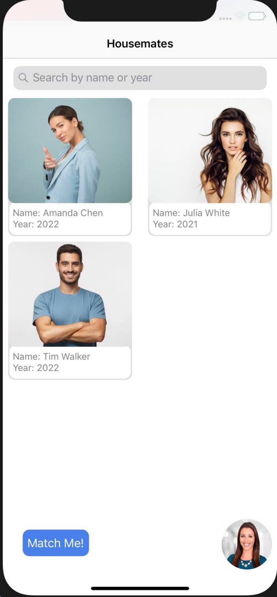
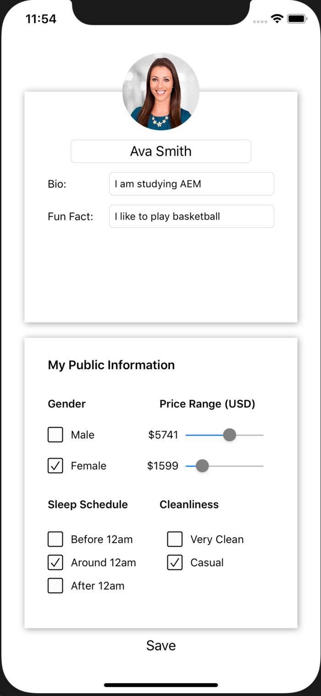
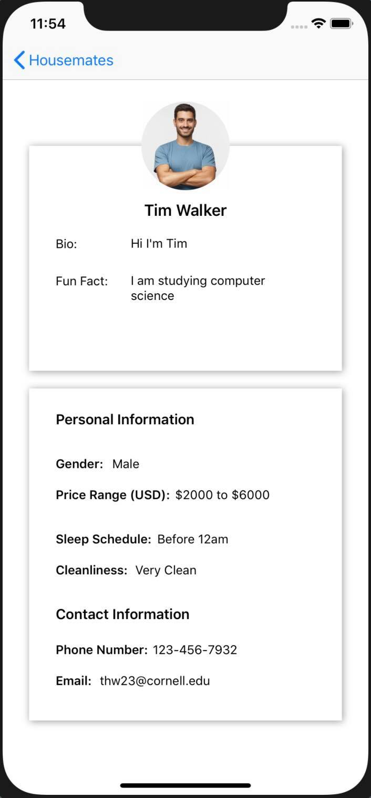

# Housemate Hunter
Connecting current and former Cornell students to roommates for the summer or post-graduation

Backend API: https://paper.dropbox.com/doc/Housemate-Hunter-Backend-API--AcgyKyTL7V7sM8X27uWNebHrAg-et03mtePNtFhv6Rhyqplt

A roommate matching app, where users can create a profile and enter their preferences by factors such as budget, sleeping time and cleanliness. This app’s target audience is Cornell students and its purpose is to match users for housing during summers and after graduation! On the main page, users will see a complete list of Cornell students registered on the app, and they can search people by name or graduation year. In the bottom right corner, users can input all of their person information, such as a bio, fun fact, their sleep schedule, cleanliness, and more!

### Requirements:

iOS:
- AutoLayout and NSLayoutConstraint is used
- CollectionView is used to display all of the other users
- UINavigationController is used to display profile information of each user
- ABOUT API

Backend:
- Designed an API using tables to model Users, their Locations, and Matches between potential roommates
- Used Flask and SQLAlchemy to create database and api endpoints
- Tailored return results from API calls to the needs of the iOS portion of the app
- Deployed backend to Heroku
- Used PostgreSQL for compatability with Heroku

